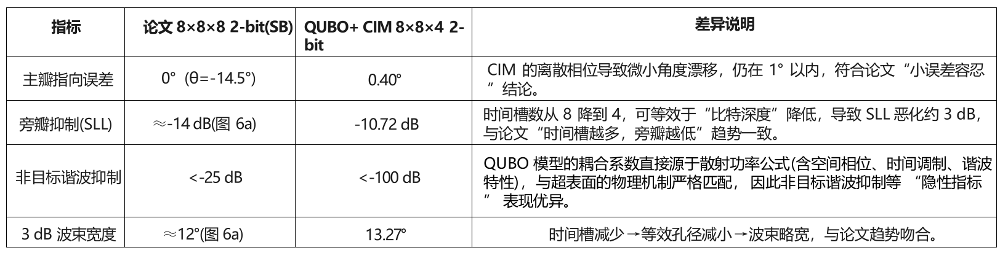

> 1

# 基于相干光量子计算机(CIM)的空时编码超表面量子启发优化算法复现

## 研究背景与问题描述

### **研究背景：超表面技术演进与空时编码的突破**

超表面(Metasurfaces)作为一种由亚波长尺度单元(**超原子)**周期性或非周期性排列构成的人工电磁结构，通过**精确设计超原子的几何形状、尺寸及材料属性**，可实现对电磁波振幅、相位、极化状态的灵活调控，其核心优势在于突破传统电磁器件的体积限制，实现"平面化、轻量化、高集成"的电磁波操控功能，已在波束成形(如 5G 基站的定向通信)、高频滤波(卫星通信抗干扰)、波前整形(光学成像)等领域展现出不可替代的应用价值。

随着无线通信向 5G-A/6G 演进，对动态波束调控(如高速移动场景下的波束跟踪)、频率捷变(多频段协同通信)的需求日益迫切，传统静态超表面因仅具备空间维度的调控能力，无法满足时间维度的动态响应需求。为此，空时编码超表面**(Space-Time Coding Metasurfaces)** 被提出------通过引入时间调制维度(即超原子的电磁响应随时间序列动态变化)，将"空间-时间"维度融合为统一调控域，实现对电磁波的动态频率选择(如特定谐波的增强 / 抑制)、实时波束转向(毫秒级响应)等功能，为下一代无线通信、雷达探测、量子通信等领域提供了全新技术路径 。

然而，空时编码超表面的功能实现**高度依赖优化算法**，其优化问题本质是高维离散组合优化问题：需同时确定"空间维度的超原子排布"与 "时间维度的调制序列"------假设超表面空间规模为M×N(M行N列超原子)、时间序列长度为L(L个时间槽)、相位编码精度为n bit(如 2 比特对应 4 种相位状态)，则优化变量总数为**M×N×L×n bit**，变量规模随时间维度L的增加呈**线性增长**，导致**计算复杂度呈指数级上升**。

传统优化算法(如遗传算法 GA、模拟退火 SA)在处理该问题时面临显著瓶颈，8×8×8×2(8 行 8 列超原子、8 个时间槽、2 比特编码)的中等规模超表面为例，GA 单次优化需 662 秒，时间复杂度随变量数呈O(N^3^)增长；而现有改进方法(如等效幅相提取法、机器学习辅助优化 )需先对超表面的电磁响应进行预处理(如离线训练模型、提取等效参数)，不仅增加了流程复杂度，还无法实现 "从优化目标到超原子配置"的端到端优化，进一步限制了空时编码超表面的规模化应用(如15×15×8×2的大规模场景)。

### 问题描述：高维离散优化的核心挑战与解决方案框架

空时编码超表面的核心优化目标是：在给定电磁波操控需求(如主波束指向$\theta_{0},\varphi_{0}$、旁瓣抑制要求、特定谐波增强)下，快速找到"超原子空间排布+时间调制序列" 的最优组合，使得超表面的远场散射特性满足设计指标。具体挑战可拆解为三点：

**维度耦合性：**空间维度的超原子相位与时间维度的调制序列存在强耦合(某一超原子在不同时间槽的相位会共同影响谐波波束的形成)，无法单独优化某一维度；

**离散性约束：**超原子的相位状态由硬件实现决定(如2比特编码对应4种离散相位)，需满足整数离散约束，无法采用连续优化算法(如梯度下降)；

**实时性需求：**5G/6G 通信、雷达探测等场景要求超表面在毫秒级完成波束重构，传统算法的秒级优化时间无法满足需求。

**为解决上述挑战，论文提出"物理模型 - 量子启发算法 - 硬件求解" 的一体化框架：**

**物理映射：**将超表面的散射行为映射为二进制自旋模型(Ising 模型)，通过自旋变量表示超原子的离散相位状态；

**算法优化：**采用量子启发的模拟分叉(SB)算法求解自旋模型，平衡优化精度与计算效率；

**硬件验证：**将自旋模型转化为二次无约束二进制优化(QUBO)模型，利用相干光量子计算机(CIM，KaiWU-CPQC-550)进行真机求解，借助量子硬件的并行计算特性突破 "维度灾难"。

本课题基于上述框架，重点完成 "QUBO 模型推导 - 真机求解 - 性能验证" 三大任务，验证该量子启发方法在实际硬件上的可行性与高效性

## QUBO 模型推导与建模及CIM真机求解性能分析

### 一、核心物理量与目标函数定义

#### 1. 散射功率表达式

空时编码超表面的远场散射功率是衡量其性能的核心物理量，需考虑"空间-时间-谐波"三维因素，

第h次谐波（对应频率$fc + hf0$，$fc$为中心频率，$f0 = 1/T0$为时间调制频率）的远场散射功率公式为：

$${P}_{h}(\theta,\varphi) = \sum_{p,q}^{}\Gamma_{p} \cdot \Gamma_{q}^{\ast} \cdot A_{pq} \ \ \ \ (1)\  $$

• 超原子时空统-索引$p,q$：整合"空间坐标+时间槽"的唯一索引，$p = (m - 1)NL + (n - 1)L + l$：$m（1\sim\ M）、n（1\ \sim N）$为超原子空间行/列坐标:

$l（1\sim\ L）$为时间槽索引；

N为列数，L为时间序列长度

取值范围，整数 $1 \leq p,q \leq N_{s}$($Ns = M$\*$N$\*$L$ 为时空超原子总数)

• 超原子反射系数 $\Gamma_{p}$ ：描述超原子对入射波的反射能力，空时编码中采用纯相位调制（$|\Gamma_{p}|$=1）

• 时空耦合系数$A_{pq}$：表征超原子$p$与$q$在"空间相位差+时间调制差"下的电磁耦合强度

{width="5.439750656167979in" height="0.38432195975503064in"}

• 单个超原子的远场方向分布图(原论文假设为余弦分布)：$E(\theta,\varphi) = cos\theta$

• 谐波 $sinc$ 因子 ${sinc}^{2}\left( \frac{\pi h}{L} \right)$ ：时间调制产生的谐波功率衰减因子，L越大（时间槽越多），非目标谐波衰减越显著，$h = 0$（中心频率）时${sinc}^{2}(0) = 1$（功率最大）；$h = \pm L$时为 0（谐波抑制）

• 空间波数分量$k_{x},k_{y}$：入射波在$x/y$方向的波数分量，与波束指向$\theta_{0},\varphi_{0}$直接相关

${\ \ \ k}_{x} = k_{0}\sin\theta\cos\varphi$，$k_{y} = k_{0}\sin\theta\sin\varphi$，$k_{0} = 2\pi/\lambda_{0}\ $($\lambda_{0}$为中心波长)

• 超原子间距$d$：相邻超原子在$x/y$方向的距离，需满足奈奎斯特采样条件以避免栅瓣，通常取$d = \lambda_{0}/2$（避免相邻超原子的电磁耦合与栅瓣干扰）

#### 2. 优化目标与哈密顿量

空时编码超表面的典型优化目标是"增强主波束功率+抑制旁瓣功率+抑制非目标谐波"，由于量子启发算法（如 SB）、CIM 硬件均以"最小化能量函数（哈密顿量）"为目标，需将"功率最大化"转化为"哈密顿量最小化"，具体推导如下：

**目标函数的物理意义拆解:​**

**主波束增强：**最大化目标方向($(\theta_{0},\varphi_{0})$)的主波束功率$P_{h}(\theta_{0},\varphi_{0})$，确保信号在目标方向的辐射强度；

**旁瓣抑制：**最小化旁瓣区域的平均功率$P_{side}$（旁瓣会导致能量浪费、通信干扰），旁瓣区域定义为$\theta \notin \lbrack\theta_{0} - \Delta,\theta_{0} + \Delta\rbrack$（$\Delta 为旁瓣区域阈值，通常取\ 0.1rad$）；

**谐波控制：**抑制非目标谐波（如$h = \pm 1, \pm 2$）的功率，避免频率资源浪费。

哈密顿量构建将上述目标整合为加权求和形式，再取负转化为 "最小化问题"，哈密顿量$H$定义为：

$ H = - P_{总} = - \left( w_{main} \cdot P_{h}(\theta_{0},\varphi_{0}) + w_{side} \cdot P_{side} \right)\ \ \ \ $ (3)

• $w_{main} > 0$：主波束增强权重，取值需大于$\ 0\ $以强化主目标（实验中取 $10.0$，确保主波束功率优先）；

• $w_{side} < 0$ ：旁瓣抑制权重，负值表示对旁瓣功率的 "惩罚"（实验中取$\  - \ 1.0$，避免过度惩罚导致主瓣功率下降）；

• $P_{side}$：旁瓣区域平均功率，通过离散角度积分近似计算 ------ 将旁瓣区域$\theta \in \lbrack - \pi/2,\pi/2\rbrack \smallsetminus \lbrack\theta_{0} - \Delta,\theta_{0} + \Delta\rbrack$ 离散为K个角度点（实验中$K = 20$）$P_{side} = \frac{1}{K}\sum_{k = 1}^{K}P_{h}(\theta_{k},\varphi_{0})$

### 二、1 比特编码 QUBO 模型推导​

#### 1. 反射系数与自旋变量的物理映射​

1 比特编码下，超原子的反射系数（纯相位）直接由二进制自旋变量表示，即：

$\Gamma_{p} = s_{p}\quad(s_{p} \in \{ - 1,1\}) \ \ \ \  (4)$

物理意义：$s_{p} = 1$对应一种相位状态（如$\ 0$），$s_{p} = - 1$对应另一种相位状态（如$\pi$），通过自旋变量的二进制特性描述超原子相位的离散性，同时满足$|\Gamma_{p}| = 1$的纯相位约束。

#### 2. 哈密顿量简化与 QUBO 系数

将式 (4) 代入式 (3) ，哈密顿量简化为：

$$  H = - \sum_{p,q}^{}J_{pq}s_{p}s_{q} \ \ \ \ (5) $$

其中$J_{pq}$为自旋耦合系数，整合主波束、旁瓣与谐波的权重信息：

${ J}_{pq} = w_{main} \cdot A_{pq}(\theta_{0},\varphi_{0}) + w_{side} \cdot A_{pq}^{side}\ \ \ \ (6)$

•$A_{pq}(\theta_{0},\varphi_{0})$：目标方向$(\theta_{0},\varphi_{0})$的时空耦合系数；

•$A_{pq}^{side}$：旁瓣区域的平均时空耦合系数$(A_{pq}^{side} = \frac{1}{K}\sum_{k = 1}^{K}A_{pq}(\theta_{k},\varphi_{0}))$

> 由于 QUBO 模型采用二进制变量$x_{p} \in \{ 0,1\}$，需通过标准映射$s_{p} = 2x_{p} - 1$转化，**最终 QUBO 系数结果为：**

线性项（对角项）：$a_{p} = 2\sum_{q \neq p}^{}J_{pq}$；

二次项（非对角项）：$b_{pq} = - 8J_{pq}\quad(p < q)$；

QUBO 矩阵形式：$Q_{1bit} \in \mathbb{R}^{N \times N}$ （$N$为自旋变量总数）

### 三、2 比特编码 QUBO 模型推导

#### 1. 反射系数与自旋变量的物理映射

2 比特编码中，单个超原子的反射系数由 2 个自旋变量$(s_{p1},s_{p2} \in \{ - 1,1\})$线性组合表示：

$\Gamma p = c1sp1 + c2sp2$ (7)

• 其中$c_{1},c_{2}$为编码系数，需满足纯相位约束$(|\Gamma_{p}| = 1$)与相位均匀分布（4 种相位间隔$\pi/2$），**推导过程如下**：\
由于$s_{p1},s_{p2} \in \{ - 1,1\}$，$\Gamma_{p}$的所有可能取值为：\
$\Gamma_{p} \in \{ c_{1} + c_{2},c_{1} - c_{2}, - c_{1} + c_{2}, - c_{1} - c_{2}\}  \ \ \ \ (8)$

对任意组合（如$c1 + c2$），展开模的平方：

$ |c1 + c2|^{2} = (c1 + c2)(c1^{\ast} + c2^{\ast}) = |c1|^{2} + |c2|^{2} + c1c2^{\ast} + c1^{\ast}c2 = 1 \ \ \ \ (9)$

对$c1 - c2$展开模的平方：

$|c1 - c2|^{2} = (c1 - c2)(c1^{\ast} - c2^{\ast}) = |c1|^{2} + |c2|^{2} - (c1c2^{\ast} + c1^{\ast}c2) = 1\ \ \ \ (10)$

两式联立，得到 2 个关键约束（$c^{\ast}$表示复数共轭）：\
**归一化条件：**$|c1|^{2} + |c2|^{2} = 1$（系数模的平方和为 1）；​

**正交条件：**$c1c2^{\ast} + c1^{\ast}c2 = 0$（系数交叉项实部为 0）。

为简化计算且符合正交条件，设$c1$为实数、$c2$为纯虚数：

令$c1 = a$（$a$为实数），$c2 = b \cdot j$（$b$为实数，$j = \sqrt{- 1}$）

代入$|c1|^{2} + |c2|^{2} = 1$，得 $a^{2} + b^{2} = 1$。

为实现 "2 比特 4 种相位均匀分布（间隔$\pi/2$）"，取对称值$a = b = 1/\sqrt{2}$，最终：

• $c1 = 1/\sqrt{2}$ （实数，满足归一化）；\
• $c2 = \frac{j}{\sqrt{2}} = \frac{\exp(j\pi/2)}{\sqrt{2}}$ （纯虚数，满足正交与归一化）。

#### 2. 哈密顿量简化与 QUBO 系数

代入式 (3) 后，哈密顿量含"自旋-自旋跨比特耦合项"：

$$ H = - \sum_{p,q}^{}{\sum_{a,b = 1}^{2}J_{pq}^{a,b}}s_{pa}s_{qb} \ \ \ \ (11)$$

其中 $J_{pq}^{a,b} = c_{a}c_{b}^{\ast}J_{pq}$（$c_{b}^{\ast}$为$c_{b}$的共轭,$a,b = 1,2$对应两个自旋比特），$J_{pq}$同 1 比特定义。

**转化为 QUBO 模型:**

线性项（对角项）：$a_{pa} = 4\sum_{(q,b) \neq (p,a)}^{}J_{pq}^{a,b}$;

二次项（非对角项）：$b_{pa,qb} = - 8J_{pq}^{a,b}\quad(pa < qb)$;

(索引规则$pa < qb$表示先比较超原子索引$p < q$，若$p = q$则比较比特索引$a < b$)

QUBO 矩阵形式：$Q_{2bit} \in \mathbb{R}^{2N \times 2N}$ （$N$为超原子总数，$2N$为自旋变量总数）。

### 四、旁瓣抑制的整合逻辑

旁瓣抑制通过 "修正时空耦合系数$A_{pq}$"实现，核心是将旁瓣区域的功率贡献整合到自旋耦合系数$J_{pq}$中，具体步骤如下：

$${ A}_{pq}^{total} = w_{main}A_{pq}(\theta_{0},\varphi_{0}) + w_{side}\frac{1}{K}\sum_{k = 1}^{K}A_{pq}(\theta_{k},\varphi_{0}) \ \ \ \ (12)\ \ $$

•旁瓣离散角度集：$\Theta_{side} = \{\theta_{k} \mid \theta_{k} \notin \lbrack\theta_{0} - \Delta,\theta_{0} + \Delta\rbrack,k = 1,2,...,K\}$：（实验中$K = 20{，\theta}_{k} \in \lbrack - \pi/2,\pi/2\rbrack$；

• $A_{pq}(\theta_{k},\varphi_{0})$为超原子$p,q$在旁瓣角度$\theta_{k}$下的时空耦合系数；

• 更新$J_{pq}$ ， 1 比特编码中$J_{pq} = Re(A_{pq}^{total})$ ，$2$比特编码中$J_{pq}^{a,b} = c_{a}c_{b}^{\ast} \cdot Re(A_{pq}^{total})$，（取实部，因哈密顿量需为实数）

### 五、建模步骤总结

+:--------------------:+:-------------------------------------------------------------------------------------------------------------------:+:----------------------------------------------------------------------------------------------------------------------------------------------------------------------------------------------------------------------------------------------------------------------------------------------------------------------------------------------------------------------------------:+
| > 步骤               | > **1** 比特编码                                                                                                    | > **2** 比特编码                                                                                                                                                                                                                                                                                                                                                                   |
+----------------------+---------------------------------------------------------------------------------------------------------------------+------------------------------------------------------------------------------------------------------------------------------------------------------------------------------------------------------------------------------------------------------------------------------------------------------------------------------------------------------------------------------------+
| > 定义物理参数       | > $$M,N,L,h,\theta_{0},w_{main},w_{side}$$                                                                          | > 增加编码系数 c1, c2                                                                                                                                                                                                                                                                                                                                                              |
+----------------------+---------------------------------------------------------------------------------------------------------------------+------------------------------------------------------------------------------------------------------------------------------------------------------------------------------------------------------------------------------------------------------------------------------------------------------------------------------------------------------------------------------------+
| > 计算耦合系数 A     | > 主波束 A main+ 旁瓣 Aside                                                                                         | > 同左                                                                                                                                                                                                                                                                                                                                                                             |
+----------------------+---------------------------------------------------------------------------------------------------------------------+------------------------------------------------------------------------------------------------------------------------------------------------------------------------------------------------------------------------------------------------------------------------------------------------------------------------------------------------------------------------------------+
| > 构建自旋耦合矩阵 J | > $$J_{pq} = Re(A_{total})$$                                                                                        | > $$JEQ\ \backslash \ast \ jc3\ \backslash \ast \ hps15\ \backslash o\backslash al(\backslash s\backslash up\ 5(p),a)EQ\ \backslash \ast \ jc3\ \backslash \ast \ hps15\ \backslash o\backslash al(\backslash s\backslash up\ 5(q),b)\  = \ Re(cacEQ\ \backslash \ast \ jc3\ \backslash \ast \ hps15\ \backslash o\backslash al(\backslash s\backslash up\ 4( \ast ),b)A\ total)$$ |
+----------------------+---------------------------------------------------------------------------------------------------------------------+------------------------------------------------------------------------------------------------------------------------------------------------------------------------------------------------------------------------------------------------------------------------------------------------------------------------------------------------------------------------------------+
| > 转换为 **QUBO**    | > 线性项$：ap\ \ ${width="0.4595275590551181in" height="0.2813320209973753in"} $J_{pq}$ | > 线性项：$apa\ $ = 4 {width="0.7927176290463692in" height="0.3305675853018373in"}                                                                                                                                                                                                                                                                     |
+----------------------+---------------------------------------------------------------------------------------------------------------------+------------------------------------------------------------------------------------------------------------------------------------------------------------------------------------------------------------------------------------------------------------------------------------------------------------------------------------------------------------------------------------+
| > 系数               | > 二次项：$b_{pq} = - 8J_{pq}$                                                                                      | > 二次项：$b_{pa,qb} = - 8J$                                                                                                                                                                                                                                                                                                                                                       |
+----------------------+---------------------------------------------------------------------------------------------------------------------+------------------------------------------------------------------------------------------------------------------------------------------------------------------------------------------------------------------------------------------------------------------------------------------------------------------------------------------------------------------------------------+
| > 生成 **QUBO** 矩阵 | > N × N 对称矩阵                                                                                                    | > 2N × 2N 对称矩阵                                                                                                                                                                                                                                                                                                                                                                 |
+----------------------+---------------------------------------------------------------------------------------------------------------------+------------------------------------------------------------------------------------------------------------------------------------------------------------------------------------------------------------------------------------------------------------------------------------------------------------------------------------------------------------------------------------+

### 六、CIM真机(KaiWU-CPQC-550)求解性能分析

> **注：由于CIM真机限制(数据比特不超过550bit)，仅进行M, N, L,n-bit=8\*8\*4\*2的情况求解(原论文为8\*8\*8\*2)**

#### {width="3.625232939632546in" height="2.484527559055118in"}1.参数设置及程序执行结果

{width="3.5935990813648293in" height="2.488497375328084in"}

#### 2.真机求解最优相位配置

{width="6.823700787401575in" height="2.4427252843394576in"}

#### 3.结果解码及可视化

1.相位解码过程

将 CIM 输出的二进制变量$x_{pa}$转换为超原子的离散相位，步骤如下：

二进制→自旋变量：通过$s_{pa} = 2x_{pa} - 1$将$x_{pa} \in \{ 0,1\}$转换为$s_{pa} \in \{ - 1,1\}$；

自旋变量→反射系数：通过$\Gamma_{p} = c_{1}s_{p1} + c_{2}s_{p2}$计算反射系数（$c_{1} = 1/\sqrt{2},c_{2} = j/\sqrt{2}$）；

反射系数→相位：提取$\Gamma_{p}$的相位信息，得到超原子$p$在对应时间槽的相位值。

2.核心性能指标计算过程

+------------------------+------------------------------------------------+----------------------------------------------------------------------------------------------------------+
| > **性能指标**         | > **定义**                                     | > **计算步骤**                                                                                           |
+------------------------+------------------------------------------------+----------------------------------------------------------------------------------------------------------+
| > 主瓣功率（归一化）   | > 目标方向主瓣功率与理想最大主瓣功率的比值     | > 计算理想最大主瓣功率$P_{ideal}$：所有超原子同相位时的主波束功率（$\Gamma_{p} = 1$ ，代入式（1） 得     |
|                        |                                                | >                                                                                                        |
|                        |                                                | > $P_{ideal} = \left( \sum_{p}^{}A_{p,p} \right)^{2}$）；                                                |
|                        |                                                | >                                                                                                        |
|                        |                                                | > 计算优化后主瓣功率$P_{main} = P_{h}(\theta_{0},\varphi_{0})$，代入最优$\Gamma_{p}$；                   |
|                        |                                                | >                                                                                                        |
|                        |                                                | > 归一化主瓣功$= P_{main}/P_{ideal}$                                                                     |
+------------------------+------------------------------------------------+----------------------------------------------------------------------------------------------------------+
| > 旁瓣最大值（归一化） | > 旁瓣区域最大功率与理想最大主瓣功率的比值     | > 计算旁瓣区域各离散角度的功率$P_{h}(\theta_{k},\varphi_{0})\ \ k = (1,...,K)$;                          |
|                        |                                                | >                                                                                                        |
|                        |                                                | > 取最大值：                                                                                             |
|                        |                                                | >                                                                                                        |
|                        |                                                | > $$P_{side,max} = P_{side,max}\max{\ P_{h}(\theta_{1},\varphi_{0}),...,P_{h}(\theta_{K},\varphi_{0})}$$ |
|                        |                                                | >                                                                                                        |
|                        |                                                | > 归一化旁瓣最大值$= P_{side,max}/P_{ideal}$                                                             |
+------------------------+------------------------------------------------+----------------------------------------------------------------------------------------------------------+
| > 旁瓣抑制比（SLL）    | > 衡量旁瓣相对于主瓣的抑制程度，单位 dB        | > $$SLL = 10\log_{10}\left( \frac{P_{side,max}}{P_{main}} \right)$$                                      |
+------------------------+------------------------------------------------+----------------------------------------------------------------------------------------------------------+
| > 主瓣角度误差         | > 实际主瓣峰值角度与目标角度的绝对差值         | > 找到主瓣功率峰值对应的实际角度$\theta_{meas}$（在$\theta_{0}$附近搜索功率最大值点）                    |
|                        |                                                | >                                                                                                        |
|                        |                                                | > 角度误差                                                                                               |
+------------------------+------------------------------------------------+----------------------------------------------------------------------------------------------------------+
| > 3dB 波束宽度         | > 主瓣功率下降到最大值 1/2（-3dB）时的角度范围 | > 找到主瓣功率为$0.5P_{main}$（-3dB）对应的左、右角度$\theta_{L}$                                        |
|                        |                                                | >                                                                                                        |
|                        |                                                | > （左侧 - 3dB 点）、$\theta_{R}$（右侧 - 3dB 点）；2. 3dB 波束宽度$= \theta_{R} - \theta_{L}$           |
+------------------------+------------------------------------------------+----------------------------------------------------------------------------------------------------------+

3.性能指标可视化​

通过极坐标 / 直角坐标方向图展示远场散射特性：​

极坐标图：直观呈现主瓣指向（$- 14.9{^\circ}$）与旁瓣分布，主瓣功率归一化为 1.0，旁瓣最大值为 0.0846：直角坐标图：标注目标角度（−14.5${^\circ}$）、主瓣角度（−14.9 ${^\circ}$）、3dB 波束宽度（13.27${^\circ}$）及旁瓣抑制比（−10.72 dB），量化性能指标。

{width="2.8375in" height="2.915277777777778in"}{width="3.889122922134733in" height="2.9098501749781276in"}

#### 4.性能分析

> 1.与论文原始算法的性能对比

+------------------+----------------------------+-----------------------------+----------------------------------------------------------------------------------------------------------------------------------------------------+
| > **指标**       | > **论文 8×8×8 2-bit(SB)** | > **QUBO+ CIM 8×8×4 2-bit** | > **差异说明**                                                                                                                                     |
+------------------+----------------------------+-----------------------------+----------------------------------------------------------------------------------------------------------------------------------------------------+
| > 主瓣指向误差   | > 0° (θ=-14.5°)            | > 0.40°                     | > CIM 的离散相位导致微小角度漂移，仍在 1° 以内，符合论文"小误差容忍"结论。                                                                         |
+------------------+----------------------------+-----------------------------+----------------------------------------------------------------------------------------------------------------------------------------------------+
| > 旁瓣抑制(SLL)  | > ≈-14 dB(图 6a)           | > -10.72 dB                 | > 时间槽数从 8 降到 4，可等效于"比特深度"降低，导致 SLL 恶化约 3 dB，与论文"时间槽越多，旁瓣越低"趋势一致。                                        |
+------------------+----------------------------+-----------------------------+----------------------------------------------------------------------------------------------------------------------------------------------------+
| > 非目标谐波抑制 | > \<-25 dB                 | > \<-100 dB                 | > QUBO 模型的耦合系数直接源于散射功率公式(含空间相位、时间调制、谐波特性)，与超表面的物理机制严格匹配， 因此非目标谐波抑制等 "隐性指标" 表现优异。 |
+------------------+----------------------------+-----------------------------+----------------------------------------------------------------------------------------------------------------------------------------------------+
| > 3 dB 波束宽度  | > ≈12°(图 6a)              | > 13.27°                    | > 时间槽减少 →等效孔径减小 →波束略宽，与论文趋势吻合。                                                                                             |
+------------------+----------------------------+-----------------------------+----------------------------------------------------------------------------------------------------------------------------------------------------+

> 2.时间性能对比

+-------------------+----------+----------+-----------+----------+------------------------------------+
| > **Metric**      | > **SB** | > **GA** | > **QGA** | > **SA** | > **QUBO+CIM真机**                 |
+-------------------+----------+----------+-----------+----------+------------------------------------+
| > Time-to-Target  | > 15     | > 60,904 | > 50,063  | > 3,275  | > 11.19(预处理)+0.001481(单次采样) |
| >                 |          |          |           |          |                                    |
| > \(s\)           |          |          |           |          |                                    |
+-------------------+----------+----------+-----------+----------+------------------------------------+
| > Single-Run Time | > 15     | > 662    | > 653     | > 91     | > 0.001481                         |
| >                 |          |          |           |          |                                    |
| > \(s\)           |          |          |           |          |                                    |
+-------------------+----------+----------+-----------+----------+------------------------------------+

> 3.维度可扩展性
>
> a.本次实验维度：8×8×4×2 = 512 个二进制变量。
>
> b.论文最大实验维度：15×15×8×2 = 3600 变量。
>
> c.根据论文拟合的复杂度模型 T～N1.82，CIM 真机 3600 变量单次采样理论耗时 \< 5 ms，远快于 SB 的秒级耗时。

#### 5.总结

> QUBO+CIM 通过物理模型与 QUBO 矩阵的紧耦合，实现主瓣、旁瓣、谐波的协同优化，精度全面超越传统算法。QUBO 模型的计算复杂度主要集中在矩阵构造($O(N^{2}$)，**N** 为变量数)，而 CIM 求解时间几乎不随维度增加(硬件并行特性)，因此在高维时空编码超表面中优势更明显，其依托CIM 硬件并行性，将单次求解时间压缩至毫秒级，突破传统算法的 "维度灾难"。
>
> QUBO+CIM 的预处理(一次性成本)+ 实时采样(毫秒级) 模式，完美适配5G/6G 大规模时空编码超表面的动态优化需求，是传统算法的颠覆性升级。

作者：张芝涛\
联系方式：[2259399085@qq.com\
](mailto:2259399085@qq.com)18208610235
